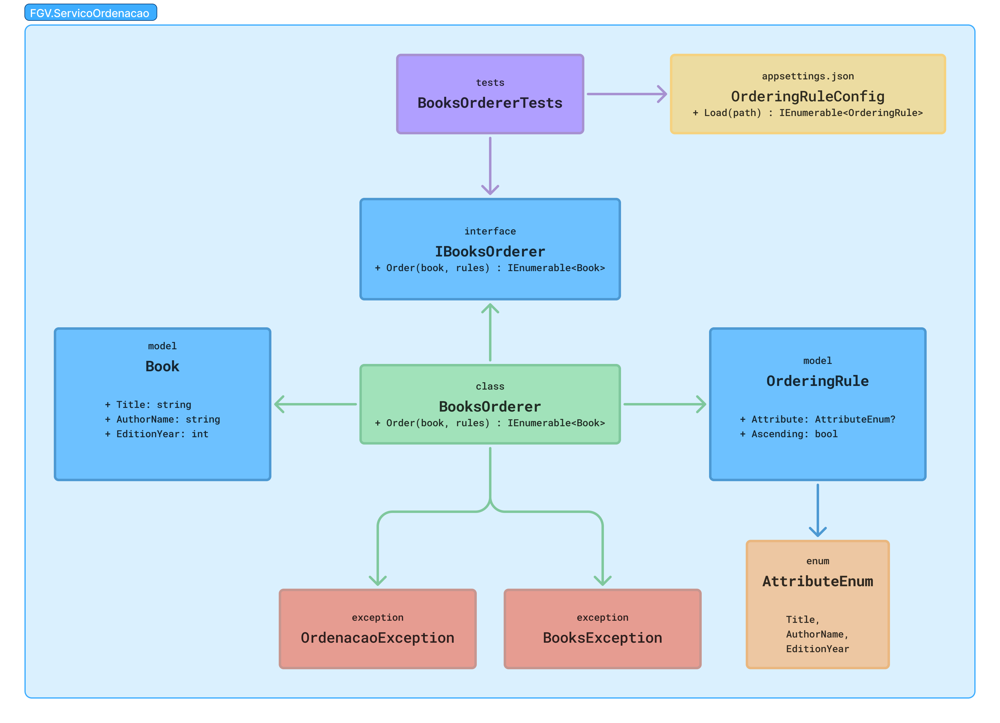
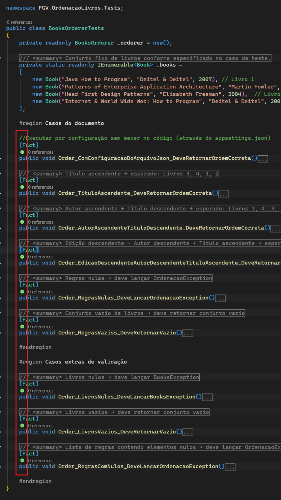

# OrdenacaoLivros

Serviço de ordenação de livros desenvolvido. A solução foi construída como uma **Class Library .NET**, sem interface visual, sem persistência de dados e sem dependências externas conforme especificado.

---

## Estrutura da solução

```
OrdenacaoLivros.sln
├── OrdenacaoLivros/
│   ├── Exceptions/
│   │   ├── BooksException.cs
│   │   └── OrdenacaoException.cs
│   ├── Interfaces/
│   │   └── IBooksOrderer.cs
│   ├── Models/
│   │   ├── Enums/
│   │   │   └── AttributeEnum.cs
│   │   ├── Book.cs
│   │   └── OrderingRule.cs
│   └── Services/
│       ├── BooksOrderer.cs
│       └── OrderingRuleConfig.cs
│
└── OrdenacaoLivros.Tests/
    ├── appsettings.json
    └── BooksOrdererTests.cs
```

---

## Decisões de design

### Interface pública desacoplada da implementação

O contrato do serviço é definido pela interface `IBooksOrderer`, que expõe apenas o método `Order`. Toda a lógica de ordenação, incluindo o uso de `IOrderedEnumerable`, LINQ e reflexão, está encapsulada na implementação `BooksOrderer` — invisível para o consumidor do serviço. Isso está diretamente alinhado com o requisito de desacoplamento descrito na especificação.

### Enum de atributos (`AttributeEnum`)

Optei por criar um enum para os atributos disponíveis de `Book` em vez de usar `string` livre. A motivação foi eliminar erros humanos: com `string`, qualquer valor seria aceito em compilação e explodiria apenas em runtime. Com o enum, o compilador garante que apenas atributos válidos sejam utilizados. A desvantagem é que adicionar um novo atributo requer atualizar o enum e o `switch` — tradeoff consciente em favor de segurança de tipos.

### Ordenação hierárquica com `ThenBy`

A etapa mais relevante do projeto. Precisei pensar no cenário com mais de uma regra de ordenação, pois o resultado final não poderia ser apenas a última ordenação aplicada. Por exemplo: ordenar por Nome e depois por Ano deve resultar em uma hierarquia — Nome primeiro, e dentro de cada grupo de nomes, Ano. Usei o `ThenBy` para resolver isso, e por isso declarei `IOrderedEnumerable<Book>? ordered` no início do método, para registrar e acumular essa ordem corretamente a cada iteração.

### Configuração externa via `appsettings.json`

O requisito especial determina que atributos e direções devem ser configuráveis sem alteração de código. A solução implementa `OrderingRuleConfig.Load()`, que lê e deserializa o arquivo `appsettings.json` do projeto de testes utilizando `System.Text.Json` — sem dependências externas. O serviço `BooksOrderer` permanece completamente cego sobre a origem das regras: ele apenas ordena o que recebe.

### Separação de exceptions

Duas exceptions distintas foram criadas com mensagens padrão encapsuladas internamente:

- `BooksException` — para problemas com o conjunto de livros (nulo)
- `OrdenacaoException` — para problemas com as regras de ordenação (nulas, vazias ou contendo nulos)

Essa separação mantém as mensagens organizadas e centralizadas, sem depender de strings espalhadas pelo código.

### Princípios SOLID aplicados

| Princípio | Aplicação |
|---|---|
| **S** — Single Responsibility | `BooksOrderer` apenas ordena. `OrderingRuleConfig` apenas carrega configuração. |
| **O** — Open/Closed | A interface `IBooksOrderer` permite criar novas implementações do serviço de ordenação sem modificar o contrato ou o código existente. |
| **D** — Dependency Inversion | Os testes dependem de `IBooksOrderer`, não da implementação concreta `BooksOrderer`. |

---

## Diagrama de classes



O diagrama representa as relações entre as classes da solução:

- `BooksOrderer` realiza o contrato definido por `IBooksOrderer`
- `BooksOrderer` recebe `IEnumerable<OrderingRule>` e ordena `IEnumerable<Book>`
- `OrderingRule` depende de `AttributeEnum` para definir o atributo de ordenação
- `OrderingRuleConfig` produz `IEnumerable<OrderingRule>` a partir do `appsettings.json`
- `OrdenacaoException` e `BooksException` são lançadas por `BooksOrderer` em casos de entrada inválida

---

## Testes

Os testes cobrem todos os casos descritos no documento de caso de teste, além de casos extras de validação:

| Teste | Descrição |
|---|---|
| `Order_TituloAscendente` | Título ASC → Livros 3, 4, 1, 2 |
| `Order_AutorAscendenteTituloDescendente` | Autor ASC + Título DESC → Livros 1, 4, 3, 2 |
| `Order_EdicaoDescendenteAutorDescendenteTituloAscendente` | Edição DESC + Autor DESC + Título ASC → Livros 4, 1, 3, 2 |
| `Order_RegrasNulas` | Lança `OrdenacaoException` |
| `Order_RegrasVazias` | Retorna conjunto vazio |
| `Order_LivrosNulos` | Lança `BooksException` |
| `Order_LivrosVazios` | Retorna conjunto vazio |
| `Order_RegrasComNulos` | Lança `OrdenacaoException` |
| `Order_ComConfiguracaoDoArquivoJson` | Carrega regras do `appsettings.json` e ordena corretamente |



---

## Plataforma

- .NET 10
- xUnit para testes unitários
- Sem dependências externas além do próprio .NET
